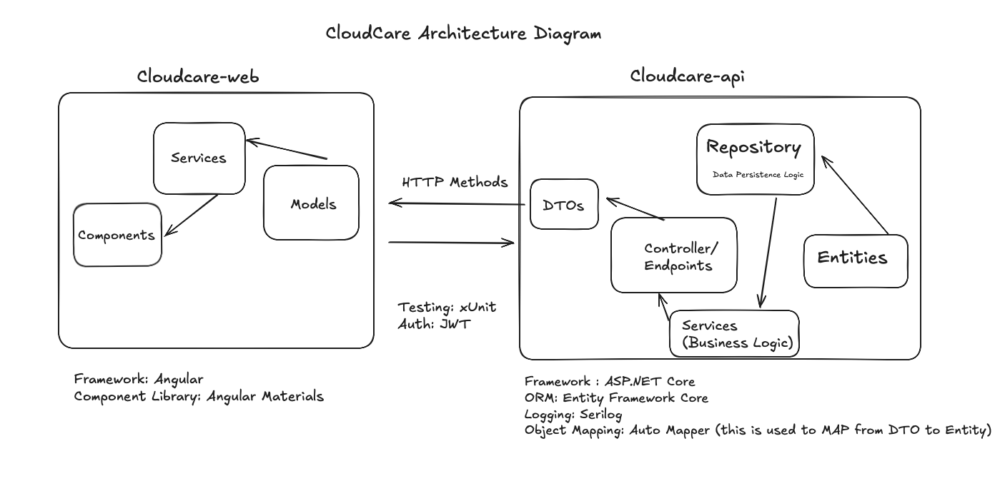
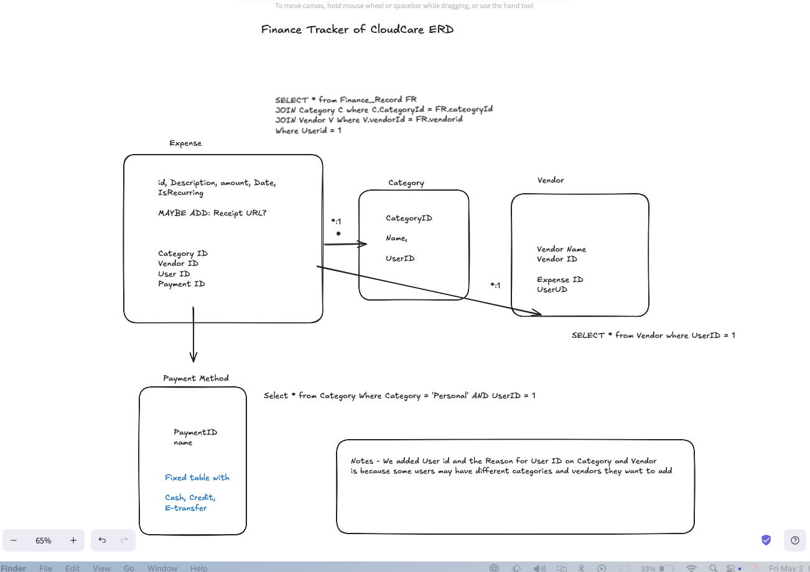
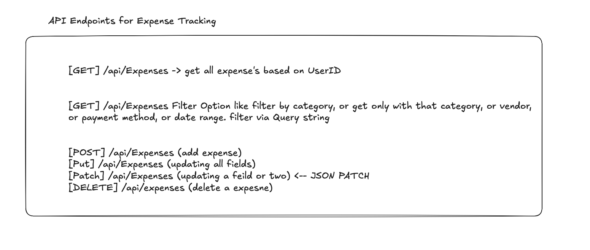

# CloudCare – Daycare Management System

## Overview

CloudCare is a full-stack daycare management platform that helps automate administrative tasks like tracking expenses, generating invoices, managing categories/vendors, and logging student attendance. The purpose of this system is to reduce manual paperwork for daycare providers and streamline operations across finance, reporting, and student management.

---

## How It Started

This project was originally inspired by my volunteer work at Sam's Daycare. I witnessed firsthand the inefficiencies involved in manual record-keeping and the challenges in managing finances, generating receipts, and tracking student hours.

In my first year of university, I built a basic version of this system using:
- **Backend:** Python (Flask)
- **Database:** SQLite via SQLAlchemy ORM
- **Deployment:** Free VPS hosting

Although that version worked, it lacked scalability, had frequent bugs, and I didn’t yet understand how to design maintainable, secure applications.

---

## How It Evolved

During my second co-op term at Evraz North America, I worked on internal enterprise systems using clean architecture principles, layered separation (DTOs, services, repositories), secure authentication, and domain-driven design. I began to apply those concepts to rebuild CloudCare with a proper, professional-grade stack.

---

## Goals

- Allow daycare owners to manage their business in one place.
- Automate receipt generation and finance tracking.
- Provide reports with filtering capabilities (SSRS or embedded tools).
- Enable time tracking for students.
- Add a parent portal in the future for real-time updates, payments, and access to receipts.
- Self-host the system for cost efficiency and data privacy.

---

## Architecture

### Frontend (Cloudcare-web)
- **Framework:** Angular
- **Component Library:** Angular Material
- **Layers:**
  - Components (UI)
  - Services (API handlers)
  - Models (shared types)

### Backend (Cloudcare-api)
- **Framework:** ASP.NET Core
- **ORM:** Entity Framework Core
- **Logging:** Serilog
- **Authentication:** JWT
- **Testing:** xUnit
- **Mapping:** AutoMapper for DTO ↔ Entity conversion
- **Layers:**
  - Controllers / Endpoints
  - Services (business logic)
  - Repositories (data access)
  - Entities (EF models)

---

## Finance Tracker Module

This is the core of the application for tracking daycare expenses, categorized by vendor, category, and payment method.

### Entity-Relationship Diagram

- **Expense Table** contains user-linked financial records.
- **Category, Vendor, Payment Method** tables allow filtering, normalization, and reporting.

### API Endpoints

- Supports full CRUD
- Filter options via query string (by category, vendor, date, etc.)
- PATCH for partial updates using JSON Patch format

---

## License

This project is under active development and is currently intended for personal and educational use.